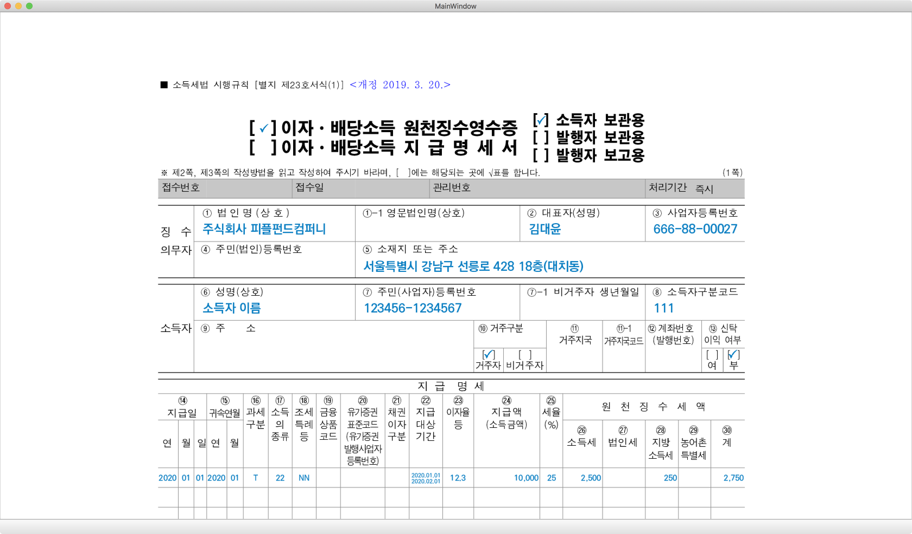

# PDF Cooking Helper
PDF 파일의 좌표를 구하는 작업을 도와주는 도구입니다.
이 도구를 사용하면 PDF 파일의 좌표를 구할 때, 출력해서 자로 재 가면서 고생하지 않아도 됩니다.

## 설치 방법

1. Python 3.7에서 작업하였습니다.
2. PDF 파일을 이미지 파일로 변환하는 과정에서 GhostScript 의존성이 필요합니다. Mac이라면 `brew install ghostscript`를 이용하여 설치할 수 있습니다.
3. Python 의존성을 설치해 줍니다. `pip3 install -r requirements.txt` 명령어로 할 수 있습니다.

## 실행 및 사용 방법

### PDF 좌표를 구하기
```sh
$ cd src
$ python3 main_ui.py
```



원하는 곳에 마우스를 클릭하면 좌측 하단에 좌표가 출력됩니다.

### 템플릿 PDF 파일에 파라미터 구워서 PDF로 만들기

[소스 코드](src/main_convertor.py)를 참고하세요.
외부 프로젝트에서 사용하려면, `pdf_core_utils.py` 파일을 복사하고 `main_convertor.py` 파일을 참고하여 사용하면 됩니다.

```sh
$ cd src
$ python3 main_convertor.py
```

## Use Case

PDF에 글자와 사진을 넣어야 할 일이 있을 때마다 요긴하게 사용했습니다.

* 피플펀드 담보채권 : 원리금수취권 증서
* 프리페이 : 정산금채권 등 양도 통지서
* 피플펀드 개인신용 : 대출자 전송용 담보부예금제공신청 계약서
* 피플펀드 원천징수 : 이자/배당소득 원천징수영수증 - 소득자 보관용
